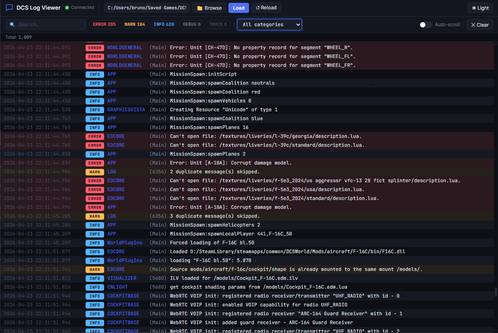

# DCS Log Viewer

A high-performance, real-time log visualizer for **Digital Combat Simulator**.  
Stream, search, and filter `dcs.log` in your browser or terminal while DCS is running — zero impact on the simulator.



---

## Features

| Feature | Details |
|---|---|
| **Real-time tail** | Polls the log file every 250 ms using a read-only share so DCS never loses its write lock |
| **Sliding window** | Keeps only the last 500 entries in memory by default (configurable) |
| **Smart parsing** | Regex extraction of Timestamp, Level, Category, Thread, Message |
| **Multiline grouping** | Stack traces / indented continuation lines collapse into an expandable row |
| **Virtual scroll** | Only DOM-renders the visible viewport rows — zero UI lag at any entry count |
| **Level filter** | Toggle ERROR / WARN / INFO / DEBUG / TRACE individually |
| **Full-text search** | Instant search across all fields (regex supported in CLI) |
| **Syntax Highlighting** | Automatic highlighting of paths, IPs, URLs, brackets, braces, and method calls |
| **CLI & Web** | Choice of a modern web interface or a `btop`-inspired terminal TUI |

---

## Requirements

- Python **3.11+**
- [uv](https://docs.astral.sh/uv/) — `pip install uv` or `winget install astral-sh.uv`

---

## Quick start

### Web Interface
```powershell
# 1. Clone / download this repository
git clone https://github.com/BrunoRV/dcs-log-viewer-public.git
cd "dcs-log-viewer-public"

# 2. Run the web server
uv run dcs-log-viewer
```
Open **http://127.0.0.1:8420** in your browser.

### CLI Client
```powershell
# Run the btop-style terminal interface
uv run dcs-log-cli <PATH_TO_DCS_LOG>
```

---

## CLI Controls

- **F2**: Toggle Sidebar (Level/Emitter Filters)
- **/**: Global Search
- **Up/Down/PgUp/PgDn/Home/End**: Navigation
- **S**: Toggle Auto-scroll
- **Esc**: Clear Filters
- **Ctrl+L**: Clear Log View
- **Q**: Quit

---

## Project Structure

```
dcs-log-viewer/
├── dcs_log_core/      ← Shared Backend Logic
│   ├── parser.py      ← Regex log parser + multiline grouping
│   ├── tailer.py      ← Async file tail with sliding window
│   └── config.py      ← JSON config persistence
├── dcs_log_web/       ← Web Frontend & API
│   ├── main.py        ← FastAPI app entry point
│   ├── routes.py      ← HTTP handlers + file browser
│   ├── ws.py          ← WebSocket server
│   └── static/        ← SPA assets (HTML/JS/CSS)
├── dcs_log_cli/       ← Terminal TUI Frontend
│   ├── app.py         ← Textual TUI application
│   ├── store.py       ← Filtering logic
│   ├── highlighter.py ← Rich syntax highlighting
│   └── styles.tcss    ← TUI Styling
├── tests/
│   ├── python/        ← Backend & API tests
│   └── js/            ← Frontend unit tests
├── pyproject.toml
└── README.md
```

---

## Development

```powershell
# Install dependencies
uv sync

# Run web app with auto-reload
uv run uvicorn dcs_log_web.main:app --reload --port 8420

# Run Python tests
uv run pytest tests/python

# Run JavaScript tests
npm test
```

---

## License

This project is licensed under the MIT License - see the [LICENSE](LICENSE) file for details.
